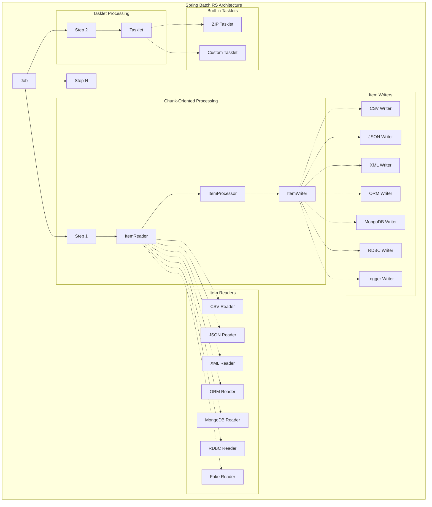

# Spring-Batch for Rust

> 🐞 A toolkit for building enterprise-grade batch applications

[](https://crates.io/crates/spring-batch-rs)
[](https://docs.rs/spring-batch-rs)
[](https://github.com/sboussekeyt/spring-batch-rs/actions/workflows/test.yml)
[](https://discord.gg/9FNhawNsG6)
[](https://codecov.io/gh/sboussekeyt/spring-batch-rs)


Inspired by the robust Java Spring Batch framework, **Spring Batch for Rust** brings its battle-tested concepts to the Rust ecosystem. It offers a comprehensive toolkit for developing efficient, reliable, and enterprise-grade batch applications. This framework is designed to address the challenges of handling large-scale data processing tasks, providing developers with the tools needed for complex batch operations.

## Architecture Overview



## Why Spring Batch for Rust ?

- **Performance & Safety:** Leverage Rust's performance and memory safety for demanding batch jobs.
- **Familiar Concepts:** If you're familiar with Spring Batch, you'll feel right at home.
- **Extensible:** Designed with modularity in mind, allowing for custom readers, writers, and processors.
- **Ecosystem:** Integrates with popular Rust crates for various data sources and formats.

## Core Concepts

Understanding these core components will help you get started:

- **Job:** Represents the entire batch process. A `Job` is composed of one or more `Step`s.
- **Step:** A domain object that encapsulates an independent, sequential phase of a batch job. Every `Job` is composed of one or more `Step`s. A `Step` can either process data in chunks (chunk-oriented processing) or execute a single task (tasklet).
- **ItemReader:** An abstraction that represents the retrieval of input for a `Step`, one item at a time.
- **ItemProcessor:** An abstraction that represents the business logic of processing an item. The item read by the `ItemReader` is passed to the `ItemProcessor`.
- **ItemWriter:** An abstraction that represents the output of a `Step`, one batch or chunk of items at a time.
- **Tasklet:** An abstraction that represents a single task or operation that can be executed as part of a step. Tasklets are useful for operations that don't fit the chunk-oriented processing model, such as file operations, database maintenance, or custom business logic.

## Features

The crate is modular, allowing you to enable only the features you need:

| **Feature**     | **Description**                                                   |
| --------------- | ----------------------------------------------------------------- |
| `mongodb`       | Enables `ItemReader` and `ItemWriter` for MongoDB databases.      |
| `rdbc-postgres` | Enables RDBC `ItemReader` and `ItemWriter` for PostgreSQL.        |
| `rdbc-mysql`    | Enables RDBC `ItemReader` and `ItemWriter` for MySQL and MariaDB. |
| `rdbc-sqlite`   | Enables RDBC `ItemReader` and `ItemWriter` for SQLite.            |
| `orm`           | Enables ORM `ItemReader` and `ItemWriter` using SeaORM.           |
| `json`          | Enables JSON `ItemReader` and `ItemWriter`.                       |
| `csv`           | Enables CSV `ItemReader` and `ItemWriter`.                        |
| `xml`           | Enables XML `ItemReader` and `ItemWriter`.                        |
| `zip`           | Enables ZIP compression `Tasklet` for file archiving.             |
| `fake`          | Enables a fake `ItemReader`, useful for generating mock datasets. |
| `logger`        | Enables a logger `ItemWriter`, useful for debugging purposes.     |
| `full`          | Enables all available features.                                   |

## Processing Models

Spring Batch for Rust supports two main processing models:

### Chunk-Oriented Processing

This is the traditional batch processing model where data is read, processed, and written in configurable chunks. It's ideal for:

- Processing large datasets
- ETL operations
- Data transformations
- Scenarios where you need transaction boundaries and fault tolerance

#### Available Item Readers & Writers

**File-based:**

- **CSV**: Read/write CSV files with configurable delimiters and headers
- **JSON**: Read/write JSON files with pretty printing support
- **XML**: Read/write XML files with custom serialization

**Database:**

- **ORM**: Read/write using SeaORM with pagination and filtering support
- **RDBC**: Direct database access for PostgreSQL, MySQL, and SQLite
- **MongoDB**: Native MongoDB document operations

**Utility:**

- **Fake**: Generate mock data for testing
- **Logger**: Debug output for development

### Tasklet Processing

Tasklets provide a simple interface for executing single tasks that don't fit the chunk-oriented model. They're perfect for:

- File operations (compression, cleanup, archiving)
- Database maintenance tasks
- System administration operations
- Custom business logic that operates on entire datasets

#### Built-in Tasklets

- **ZipTasklet**: Compress files and directories into ZIP archives with configurable compression levels and file filtering

#### Creating Custom Tasklets

Implement the `Tasklet` trait to create your own custom operations:

```rust
use spring_batch_rs::core::step::{Tasklet, StepExecution, RepeatStatus};
use spring_batch_rs::BatchError;

struct MyCustomTasklet;

impl Tasklet for MyCustomTasklet {
    fn execute(&self, step_execution: &StepExecution) -> Result<RepeatStatus, BatchError> {
        // Your custom logic here
        println!("Executing custom tasklet for step: {}", step_execution.name);
        Ok(RepeatStatus::Finished)
    }
}
```

## Getting Started

### Prerequisites

- A recent Rust toolchain installed.

### 1. Add `spring-batch-rs` to your `Cargo.toml`

Make sure to activate the features relevant to your needs:

```toml
[dependencies]
spring-batch-rs = { version = "<version>", features = ["csv", "json"] }
# Or for database operations:
spring-batch-rs = { version = "<version>", features = ["orm", "csv"] }
# Or for all features:
spring-batch-rs = { version = "<version>", features = ["full"] }
```

### 2. Chunk-Oriented Processing Example

Simple CSV to JSON transformation:

```rust
use spring_batch_rs::{
    core::{job::JobBuilder, step::StepBuilder},
    item::{csv::CsvItemReaderBuilder, json::JsonItemWriterBuilder},
    BatchError,
};
use serde::{Deserialize, Serialize};

#[derive(Deserialize, Serialize)]
struct Product {
    id: u32,
    name: String,
    price: f64,
}

fn main() -> Result<(), BatchError> {
    let csv_data = "id,name,price\n1,Laptop,999.99\n2,Mouse,29.99";

    let reader = CsvItemReaderBuilder::<Product>::new()
        .has_headers(true)
        .from_reader(csv_data.as_bytes());

    let writer = JsonItemWriterBuilder::new()
        .pretty(true)
        .from_path("products.json");

    let step = StepBuilder::new("csv_to_json")
        .chunk(10)
        .reader(&reader)
        .writer(&writer)
        .build();

    let job = JobBuilder::new().start(&step).build();
    job.run()
}
```

### 3. ORM Database Processing Example

Reading from database with SeaORM:

```rust
use spring_batch_rs::{
    core::{job::JobBuilder, step::StepBuilder},
    item::{orm::OrmItemReaderBuilder, csv::CsvItemWriterBuilder},
    BatchError,
};
use sea_orm::{Database, EntityTrait};

// Assuming you have a SeaORM entity defined
async fn process_database_to_csv() -> Result<(), BatchError> {
    let db = Database::connect("sqlite::memory:").await?;

    // Create a query with filtering and pagination
    let query = ProductEntity::find()
        .filter(product::Column::Active.eq(true))
        .order_by_asc(product::Column::Id);

    let reader = OrmItemReaderBuilder::new()
        .connection(&db)
        .query(query)
        .page_size(100)
        .build();

    let writer = CsvItemWriterBuilder::new()
        .has_headers(true)
        .from_path("active_products.csv");

    let step = StepBuilder::new("db_to_csv")
        .chunk(50)
        .reader(&reader)
        .writer(&writer)
        .build();

    let job = JobBuilder::new().start(&step).build();
    job.run()
}
```

### 4. Tasklet Processing Example

File operations using tasklets:

```rust
use spring_batch_rs::{
    core::{job::JobBuilder, step::StepBuilder},
    tasklet::zip::ZipTaskletBuilder,
    BatchError,
};

fn main() -> Result<(), BatchError> {
    let zip_tasklet = ZipTaskletBuilder::new()
        .source_path("./data")
        .target_path("./backup.zip")
        .compression_level(6)
        .build()?;

    let step = StepBuilder::new("backup_files")
        .tasklet(&zip_tasklet)
        .build();

    let job = JobBuilder::new().start(&step).build();
    job.run()
}
```

## Roadmap

We are actively working on enhancing `spring-batch-rs` with more features:

- [ ] Item filtering capabilities
- [ ] Kafka reader and writer
- [ ] Parquet reader and writer
- [ ] Advanced Retry/Skip policies for fault tolerance
- [ ] Persist job execution metadata (e.g., in a database)

## Examples

Explore more use cases and advanced configurations in our `examples` directory. Each example demonstrates a specific feature or scenario:

- [Generate CSV file from JSON file with processor](https://github.com/sboussekeyt/spring-batch-rs/blob/main/examples/generate_csv_file_from_json_file_with_processor.rs)
- [Generate JSON file from CSV string with fault tolerance](https://github.com/sboussekeyt/spring-batch-rs/blob/main/examples/generate_json_file_from_csv_string_with_fault_tolerance.rs)
- [Generate JSON file from fake persons](https://github.com/sboussekeyt/spring-batch-rs/blob/main/examples/generate_json_file_from_fake_persons.rs)
- [Generate CSV file without headers from fake persons](https://github.com/sboussekeyt/spring-batch-rs/blob/main/examples/generate_csv_file_without_headers_from_fake_persons.rs)
- [Insert records into Mysql database](https://github.com/sboussekeyt/spring-batch-rs/blob/main/examples/insert_records_into_mysql_database.rs)
- [Log records from Postgres database](https://github.com/sboussekeyt/spring-batch-rs/blob/main/examples/log_records_from_postgres_database.rs)
- [Read records from MongoDb database](https://github.com/sboussekeyt/spring-batch-rs/blob/main/examples/read_records_from_mongodb_database.rs)
- [Write records to MongoDb database](https://github.com/sboussekeyt/spring-batch-rs/blob/main/examples/write_records_to_mongodb_database.rs)
- [ZIP files using tasklet](https://github.com/sboussekeyt/spring-batch-rs/blob/main/examples/zip_files_tasklet.rs)

### Running the Examples

To run an example locally:

1. Clone the repository
2. Run a specific example using `cargo run --example <example_name> --features "<feature1>,<feature2>"`.

## License

This project is licensed under either of:

- Apache License, Version 2.0
  ([LICENSE-APACHE](LICENSE-APACHE) or <http://www.apache.org/licenses/LICENSE-2.0>)
- MIT license
  ([LICENSE-MIT](LICENSE-MIT) or <http://opensource.org/licenses/MIT>)

at your option.

## Contribution

Contributions are highly welcome! Whether it's bug reports, feature requests, documentation improvements, or code contributions, please feel free to open an issue or submit a pull request.

Unless you explicitly state otherwise, any contribution intentionally submitted for inclusion in the work by you, as defined in the Apache-2.0 license, shall be dual licensed as above, without any additional terms or conditions.
