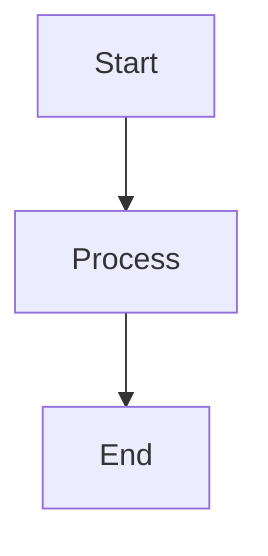
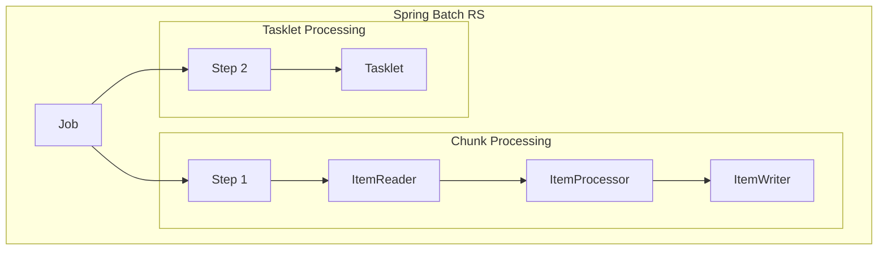

# Spring Batch RS Documentation Website

This directory contains the Docusaurus documentation website for Spring Batch RS.

## Development

### Prerequisites

- Node.js 18 or higher
- npm

### Installation

```bash
cd website
npm install
```

### Local Development

```bash
npm start
```

This command starts a local development server and opens up a browser window. Most changes are reflected live without having to restart the server.

### Build

```bash
npm run build
```

This command generates static content into the `build` directory and can be served using any static contents hosting service.

### Deployment

The website is automatically deployed to GitHub Pages when changes are pushed to the `main` branch. The deployment is handled by the GitHub Actions workflow in `.github/workflows/deploy-docs.yml`.

## Structure

- `docs/` - Documentation pages written in Markdown
- `src/` - React components and pages
- `static/` - Static assets (images, files)
- `docusaurus.config.ts` - Docusaurus configuration
- `sidebars.ts` - Sidebar navigation configuration

## Adding Documentation

1. Create new Markdown files in the `docs/` directory
2. Add them to the sidebar configuration in `sidebars.ts`
3. Use frontmatter to set page metadata:

```markdown
---
sidebar_position: 1
title: Page Title
---

# Page Content
```

## Customization

- Edit `docusaurus.config.ts` for site configuration
- Modify `src/pages/index.tsx` for the homepage
- Update `src/css/custom.css` for custom styling
- Add components in `src/components/`

## Mermaid Diagrams

The site has full Mermaid diagram support enabled. Use them in Markdown like this:



### Supported Diagram Types

- **Flowcharts**: `graph` or `flowchart`
- **Sequence Diagrams**: `sequenceDiagram`
- **State Diagrams**: `stateDiagram-v2`
- **Class Diagrams**: `classDiagram`
- **Entity Relationship**: `erDiagram`
- **User Journey**: `journey`
- **Gantt Charts**: `gantt`
- **Pie Charts**: `pie`
- **Mind Maps**: `mindmap`
- **Git Graphs**: `gitgraph`
- **XY Charts**: `xychart-beta`

### Example Architecture Diagram



The diagrams are interactive and support both light and dark themes automatically.
