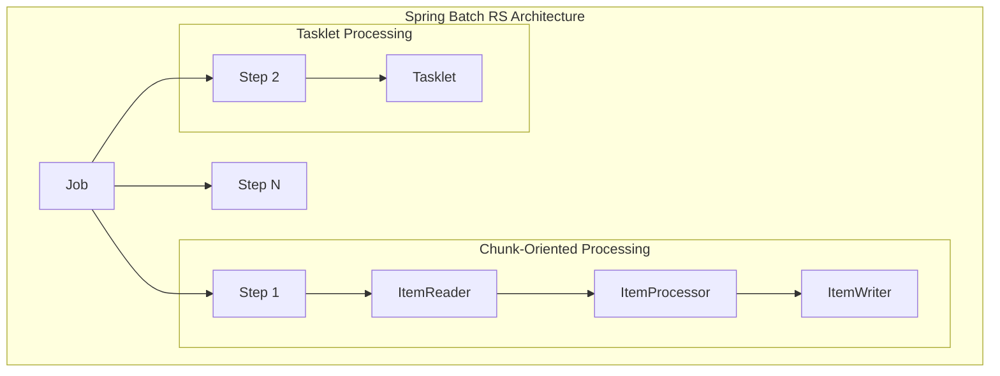
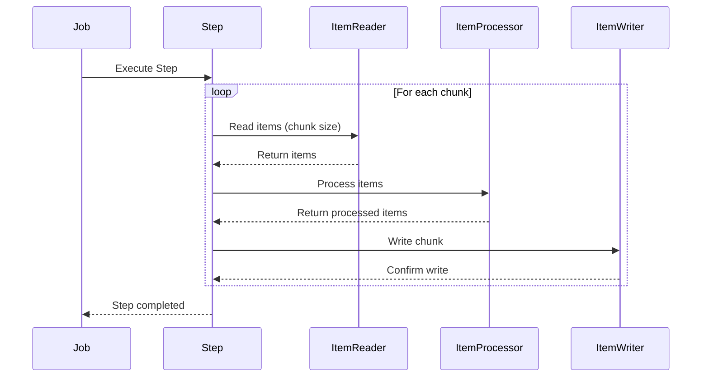
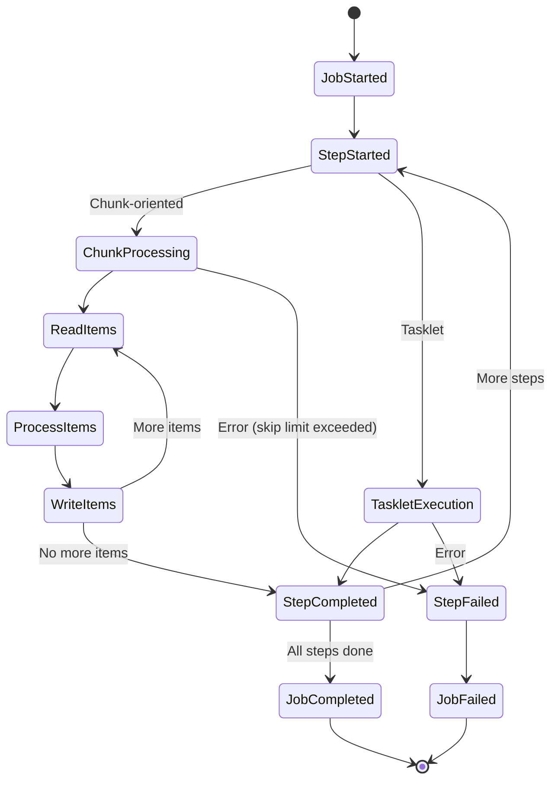
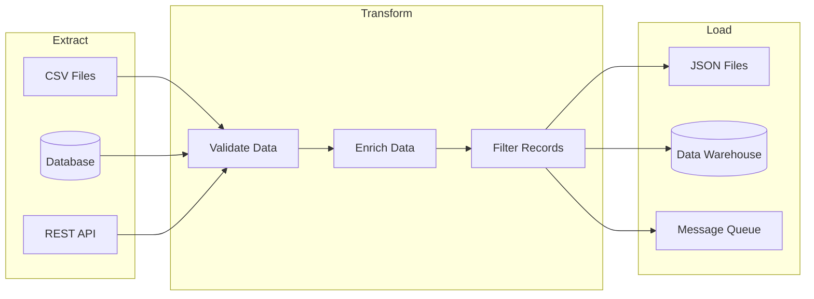
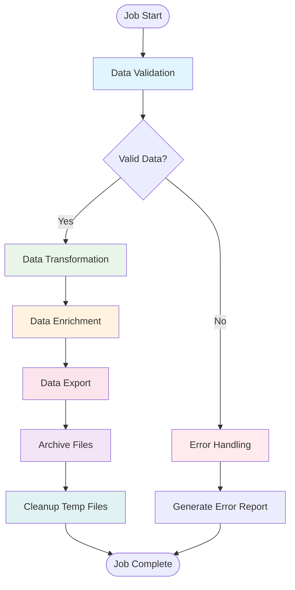
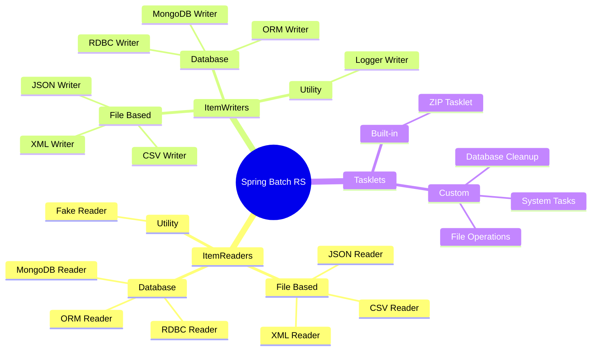
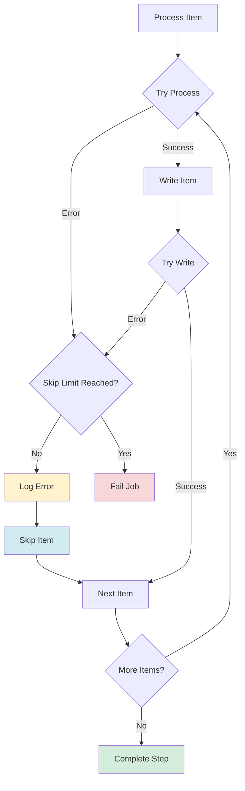
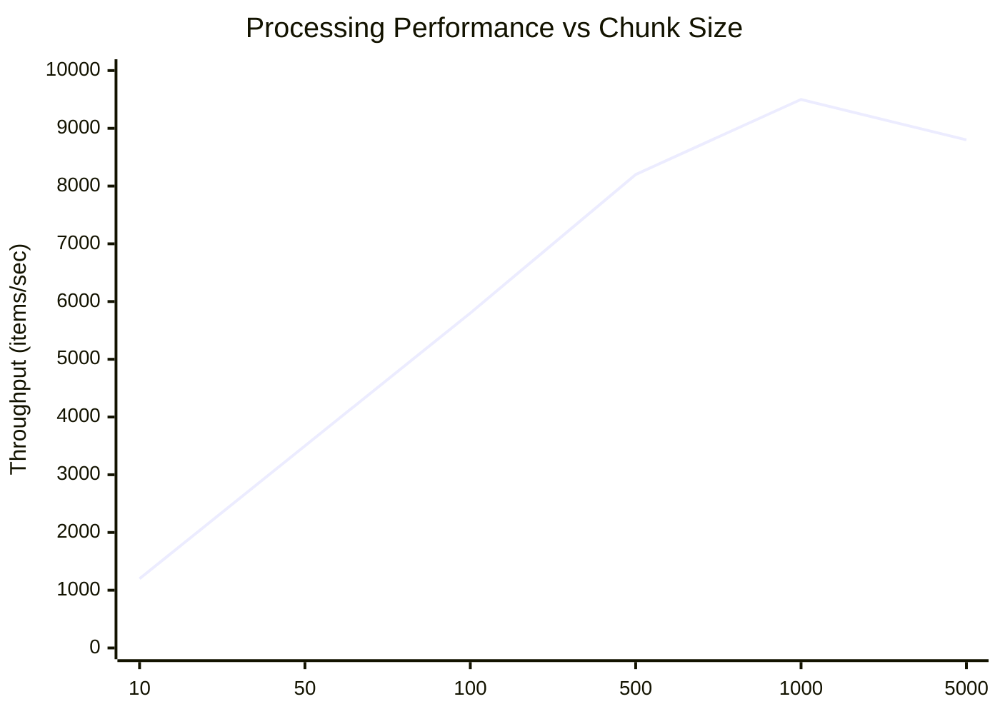

# Architecture & Diagrams

This page demonstrates the architecture and workflows of Spring Batch RS using interactive Mermaid diagrams.

## Core Architecture

The following diagram shows the overall architecture of Spring Batch RS:



## Chunk Processing Flow

Here's a detailed view of how chunk-oriented processing works:



## Job Execution Lifecycle

The complete lifecycle of a batch job execution:



## Data Flow Patterns

### ETL Pipeline Example



### Multi-Step Job Flow



## Component Relationships

### Reader-Writer Ecosystem



## Error Handling Flow



## Performance Considerations

### Chunk Size Impact



### Memory Usage Pattern

```mermaid
gitgraph
    commit id: "Job Start"
    commit id: "Load Chunk 1"
    commit id: "Process Chunk 1"
    commit id: "Write Chunk 1"
    commit id: "GC - Memory Released"
    commit id: "Load Chunk 2"
    commit id: "Process Chunk 2"
    commit id: "Write Chunk 2"
    commit id: "GC - Memory Released"
    commit id: "Job Complete"
```

These diagrams provide a comprehensive view of Spring Batch RS architecture and help understand the framework's internal workings and data flow patterns.
