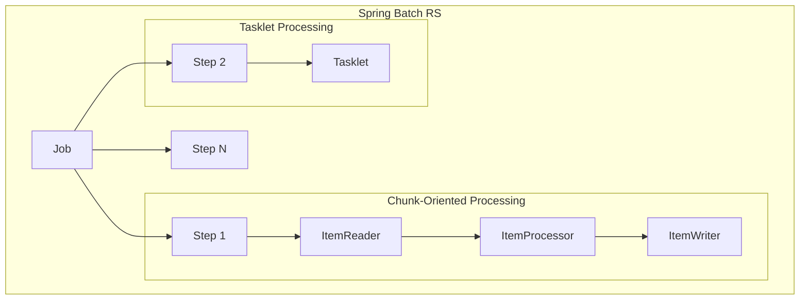

# Getting Started

Welcome to **Spring Batch RS** - a comprehensive toolkit for building enterprise-grade batch applications in Rust!

Inspired by the robust Java Spring Batch framework, **Spring Batch for Rust** brings its battle-tested concepts to the Rust ecosystem. It offers a comprehensive toolkit for developing efficient, reliable, and enterprise-grade batch applications.

## Architecture Overview



## Core Concepts

Understanding these core components will help you get started:

- **Job:** Represents the entire batch process. A `Job` is composed of one or more `Step`s.
- **Step:** A domain object that encapsulates an independent, sequential phase of a batch job. Every `Job` is composed of one or more `Step`s. A `Step` can either process data in chunks (chunk-oriented processing) or execute a single task (tasklet).
- **ItemReader:** An abstraction that represents the retrieval of input for a `Step`, one item at a time.
- **ItemProcessor:** An abstraction that represents the business logic of processing an item. The item read by the `ItemReader` is passed to the `ItemProcessor`.
- **ItemWriter:** An abstraction that represents the output of a `Step`, one batch or chunk of items at a time.
- **Tasklet:** An abstraction that represents a single task or operation that can be executed as part of a step. Tasklets are useful for operations that don't fit the chunk-oriented processing model, such as file operations, database maintenance, or custom business logic.

## Why Spring Batch for Rust?

- **Performance & Safety:** Leverage Rust's performance and memory safety for demanding batch jobs.
- **Familiar Concepts:** If you're familiar with Spring Batch, you'll feel right at home.
- **Extensible:** Designed with modularity in mind, allowing for custom readers, writers, and processors.
- **Ecosystem:** Integrates with popular Rust crates for various data sources and formats.

## Installation

Add `spring-batch-rs` to your `Cargo.toml` with the features you need:

```toml
[dependencies]
# Basic file processing
spring-batch-rs = { version = "0.1", features = ["csv", "json"] }

# Database operations
spring-batch-rs = { version = "0.1", features = ["orm", "csv"] }

# All features
spring-batch-rs = { version = "0.1", features = ["full"] }
```

## Quick Start

Here's a simple example that reads from CSV and writes to JSON:

```rust
use spring_batch_rs::{
    core::{job::JobBuilder, step::StepBuilder},
    item::{csv::CsvItemReaderBuilder, json::JsonItemWriterBuilder},
    BatchError,
};
use serde::{Deserialize, Serialize};

#[derive(Deserialize, Serialize)]
struct Product {
    id: u32,
    name: String,
    price: f64,
}

fn main() -> Result<(), BatchError> {
    let csv_data = "id,name,price\n1,Laptop,999.99\n2,Mouse,29.99";

    let reader = CsvItemReaderBuilder::<Product>::new()
        .has_headers(true)
        .from_reader(csv_data.as_bytes());

    let writer = JsonItemWriterBuilder::new()
        .pretty(true)
        .from_path("products.json");

    let processor = PassThroughProcessor::<Product>::new();

    let step = StepBuilder::new("csv_to_json")
        .chunk::<Product, Product>(10)
        .reader(&reader)
        .processor(&processor)
        .writer(&writer)
        .build();

    let job = JobBuilder::new().start(&step).build();
    job.run()
}
```

## What's Next?

- Learn about [Processing Models](./processing-models) - chunk-oriented vs tasklet processing
- Explore [Item Readers and Writers](./item-readers-writers) for different data sources
- Check out [Examples](./examples) for real-world use cases
- View detailed [Architecture & Diagrams](./architecture) with interactive Mermaid diagrams
