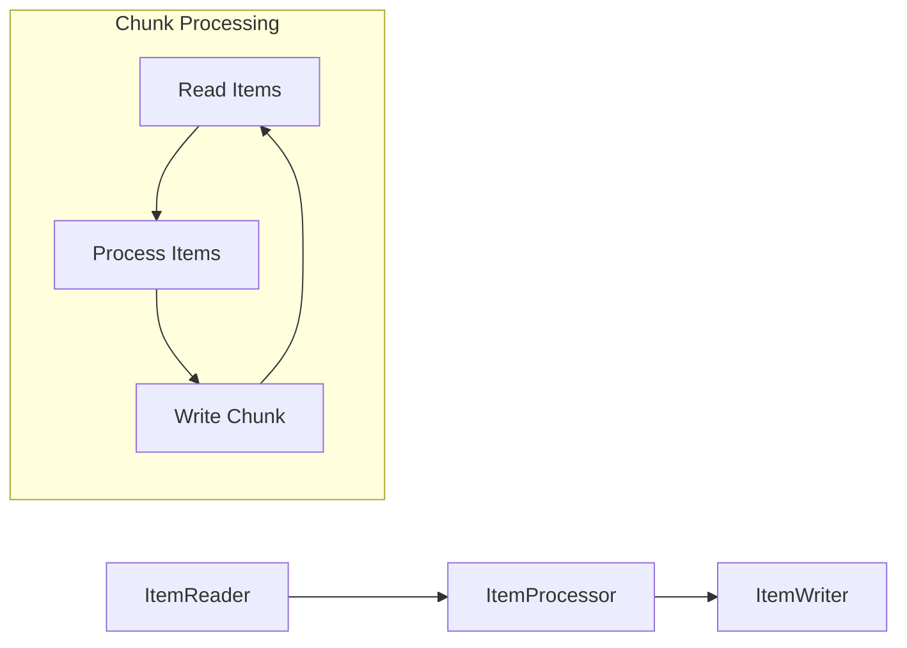

# Processing Models

Spring Batch for Rust supports two main processing models, each designed for different types of batch operations.

## Chunk-Oriented Processing

This is the traditional batch processing model where data is read, processed, and written in configurable chunks. It follows the **read-process-write** pattern and is ideal for:

- Processing large datasets
- ETL (Extract, Transform, Load) operations
- Data transformations
- Scenarios where you need transaction boundaries and fault tolerance

### How It Works



The framework reads items one by one, processes them, and then writes them in chunks (batches) to improve performance and enable transaction management.

### Example: CSV to JSON Transformation

```rust
use spring_batch_rs::{
    core::{job::JobBuilder, step::StepBuilder, item::ItemProcessor},
    item::{csv::CsvItemReaderBuilder, json::JsonItemWriterBuilder},
    BatchError,
};
use serde::{Deserialize, Serialize};

#[derive(Deserialize, Serialize, Clone)]
struct Product {
    id: u32,
    name: String,
    price: f64,
}

// Custom processor to transform data
struct PriceProcessor;

impl ItemProcessor<Product, Product> for PriceProcessor {
    fn process(&self, item: &Product) -> Result<Product, BatchError> {
        let mut processed = item.clone();
        // Apply 10% discount
        processed.price = (processed.price * 0.9).round() / 100.0 * 100.0;
        Ok(processed)
    }
}

fn main() -> Result<(), BatchError> {
    let reader = CsvItemReaderBuilder::<Product>::new()
        .has_headers(true)
        .from_path("products.csv");

    let processor = PriceProcessor;

    let writer = JsonItemWriterBuilder::new()
        .pretty(true)
        .from_path("discounted_products.json");

    let step = StepBuilder::new("apply_discount")
        .chunk(100) // Process 100 items at a time
        .reader(&reader)
        .processor(&processor)
        .writer(&writer)
        .build();

    let job = JobBuilder::new().start(&step).build();
    job.run()
}
```

## Tasklet Processing

Tasklets provide a simple interface for executing single tasks that don't fit the chunk-oriented model. They're perfect for:

- File operations (compression, cleanup, archiving)
- Database maintenance tasks
- System administration operations
- Custom business logic that operates on entire datasets

### How It Works


A tasklet executes once per step and can return either `Finished` or `Continuable` to control execution flow.

### Example: File Compression

```rust
use spring_batch_rs::{
    core::{job::JobBuilder, step::StepBuilder},
    tasklet::zip::ZipTaskletBuilder,
    BatchError,
};

fn main() -> Result<(), BatchError> {
    let zip_tasklet = ZipTaskletBuilder::new()
        .source_path("./data")
        .target_path("./backup.zip")
        .compression_level(6)
        .build()?;

    let step = StepBuilder::new("backup_files")
        .tasklet(&zip_tasklet)
        .build();

    let job = JobBuilder::new().start(&step).build();
    job.run()
}
```

### Custom Tasklets

You can create custom tasklets by implementing the `Tasklet` trait:

```rust
use spring_batch_rs::core::step::{Tasklet, StepExecution, RepeatStatus};
use spring_batch_rs::BatchError;
use log::info;

struct DatabaseCleanupTasklet {
    table_name: String,
    days_to_keep: u32,
}

impl Tasklet for DatabaseCleanupTasklet {
    fn execute(&self, step_execution: &StepExecution) -> Result<RepeatStatus, BatchError> {
        info!("Cleaning up table: {} (keeping {} days)",
              self.table_name, self.days_to_keep);

        // Your cleanup logic here
        // For example: DELETE FROM table WHERE created_at < NOW() - INTERVAL days_to_keep DAY

        info!("Cleanup completed for step: {}", step_execution.name);
        Ok(RepeatStatus::Finished)
    }
}
```

## Choosing the Right Model

| Use Chunk-Oriented When     | Use Tasklet When       |
| --------------------------- | ---------------------- |
| Processing large datasets   | Single operations      |
| Need transaction boundaries | File system operations |
| ETL operations              | Database maintenance   |
| Item-by-item processing     | System administration  |
| Need fault tolerance        | Custom business logic  |

## Combining Both Models

You can combine both processing models in a single job:

```rust
use spring_batch_rs::{
    core::{job::JobBuilder, step::StepBuilder},
    item::{csv::CsvItemReaderBuilder, json::JsonItemWriterBuilder},
    tasklet::zip::ZipTaskletBuilder,
    BatchError,
};

fn main() -> Result<(), BatchError> {
    // Step 1: Process data (chunk-oriented)
    let reader = CsvItemReaderBuilder::<Product>::new()
        .from_path("input.csv");
    let writer = JsonItemWriterBuilder::new()
        .from_path("output.json");

    let process_step = StepBuilder::new("process_data")
        .chunk(100)
        .reader(&reader)
        .writer(&writer)
        .build();

    // Step 2: Archive results (tasklet)
    let zip_tasklet = ZipTaskletBuilder::new()
        .source_path("./output.json")
        .target_path("./results.zip")
        .build()?;

    let archive_step = StepBuilder::new("archive_results")
        .tasklet(&zip_tasklet)
        .build();

    // Combine both steps in one job
    let job = JobBuilder::new()
        .start(&process_step)
        .next(&archive_step)
        .build();

    job.run()
}
```

This approach allows you to build complex batch workflows that leverage the strengths of both processing models.
