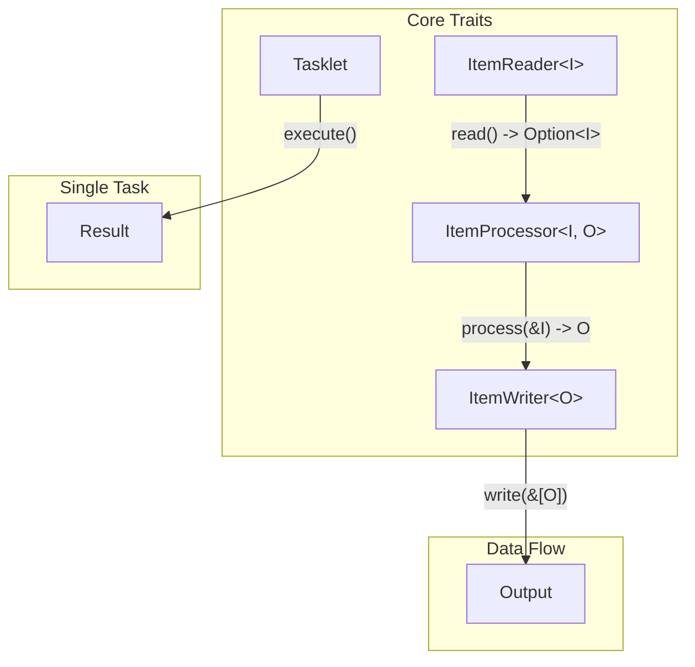

import { Card, CardGrid } from '@astrojs/starlight/components';

Spring Batch RS is built around four core traits that define the batch processing model.

## Trait Hierarchy



## Core Traits

<CardGrid>
  <Card title="ItemReader" icon="document">
    Reads items one at a time from any data source (CSV, JSON, XML, databases).
    [View ItemReader API →](/spring-batch-rs/api/item-reader/)
  </Card>
  <Card title="ItemProcessor" icon="setting">
    Transforms items from input type to output type. Optional in the pipeline.
    [View ItemProcessor API →](/spring-batch-rs/api/item-processor/)
  </Card>
  <Card title="ItemWriter" icon="pencil">
    Writes batches of items to any destination (files, databases, APIs).
    [View ItemWriter API →](/spring-batch-rs/api/item-writer/)
  </Card>
  <Card title="Tasklet" icon="rocket">
    Executes single-task operations outside the chunk-oriented model.
    [View Tasklet API →](/spring-batch-rs/api/tasklet/)
  </Card>
</CardGrid>

## Quick Reference

| Trait | Method | Returns | Purpose |
|-------|--------|---------|---------|
| `ItemReader<I>` | `read(&self)` | `Result<Option<I>, BatchError>` | Read next item |
| `ItemProcessor<I,O>` | `process(&self, &I)` | `Result<O, BatchError>` | Transform item |
| `ItemWriter<O>` | `write(&self, &[O])` | `Result<(), BatchError>` | Write batch |
| `ItemWriter<O>` | `open(&self)` | `Result<(), BatchError>` | Initialize writer |
| `ItemWriter<O>` | `close(&self)` | `Result<(), BatchError>` | Finalize writer |
| `ItemWriter<O>` | `flush(&self)` | `Result<(), BatchError>` | Flush buffers |

## Type Aliases

```rust
pub type ItemReaderResult<I> = Result<Option<I>, BatchError>;
pub type ItemProcessorResult<O> = Result<O, BatchError>;
pub type ItemWriterResult = Result<(), BatchError>;
```

## Implementation Index

### Readers by Feature

| Feature | Reader | Description |
|---------|--------|-------------|
| `csv` | `CsvItemReader<R>` | CSV files and strings |
| `json` | `JsonItemReader<I, R>` | Streaming JSON arrays |
| `xml` | `XmlItemReader<R, I>` | XML documents |
| `rdbc-postgres` | `PostgresRdbcItemReader<I>` | PostgreSQL queries |
| `rdbc-mysql` | `MysqlRdbcItemReader<I>` | MySQL/MariaDB queries |
| `rdbc-sqlite` | `SqliteRdbcItemReader<I>` | SQLite queries |
| `mongodb` | `MongodbItemReader<I>` | MongoDB collections |
| `orm` | `OrmItemReader<I>` | SeaORM entities |
| `fake` | `PersonReader` | Fake test data |

### Writers by Feature

| Feature | Writer | Description |
|---------|--------|-------------|
| `csv` | `CsvItemWriter<O, W>` | CSV files |
| `json` | `JsonItemWriter<O, W>` | JSON arrays |
| `xml` | `XmlItemWriter<O, W>` | XML documents |
| `rdbc-postgres` | `PostgresItemWriter<O>` | PostgreSQL inserts |
| `rdbc-mysql` | `MysqlItemWriter<O>` | MySQL inserts |
| `rdbc-sqlite` | `SqliteItemWriter<O>` | SQLite inserts |
| `mongodb` | `MongodbItemWriter<O>` | MongoDB inserts |
| `orm` | `OrmItemWriter<O>` | SeaORM inserts |
| `logger` | `LoggerWriter` | Debug logging |
