import { Card, CardGrid, Tabs, TabItem, Aside } from '@astrojs/starlight/components';

# Spring Batch RS Architecture

Spring Batch RS is built on proven batch processing patterns from the Java Spring Batch framework, adapted for Rust's unique strengths in performance and safety.

## High-Level Architecture

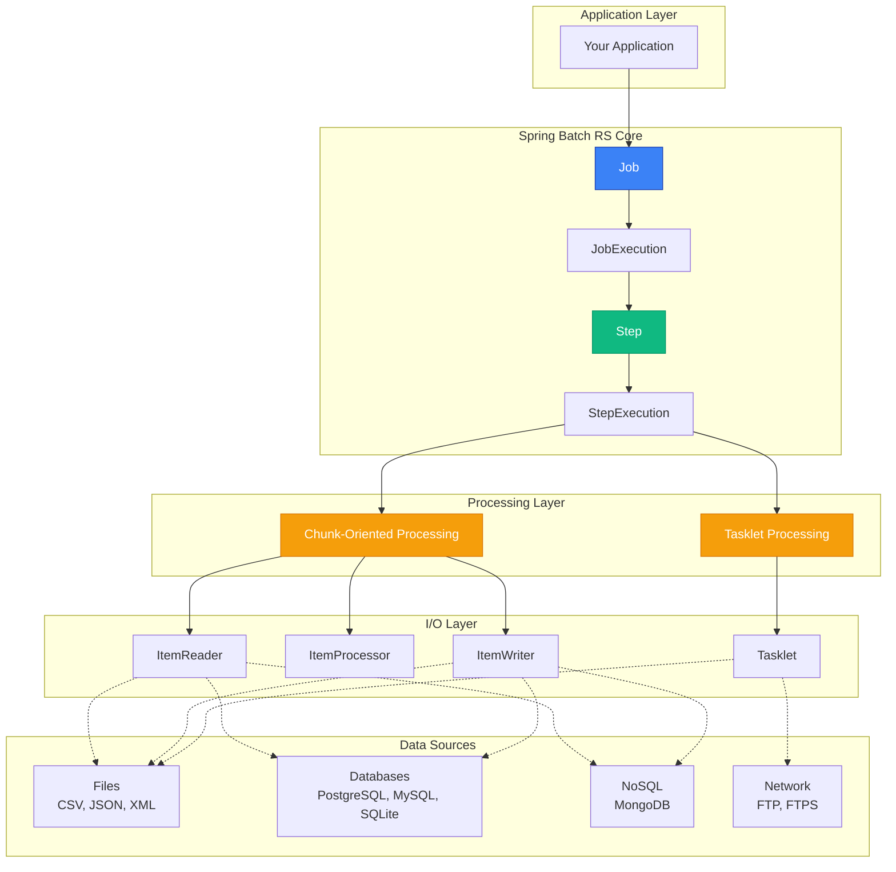

## Core Components

### Job

A **Job** represents the entire batch process. It's the top-level container that orchestrates one or more steps.

```rust
use spring_batch_rs::core::job::JobBuilder;

let job = JobBuilder::new()
    .start(&step1)
    .next(&step2)
    .next(&step3)
    .build();

let result = job.run()?;
```

**Key Characteristics:**
- Immutable once created
- Can have multiple steps executed sequentially
- Maintains execution state and metadata
- Provides rollback capabilities on failure

### Step

A **Step** is an independent, sequential phase of a Job. Each step can either process data in chunks or execute a single task.

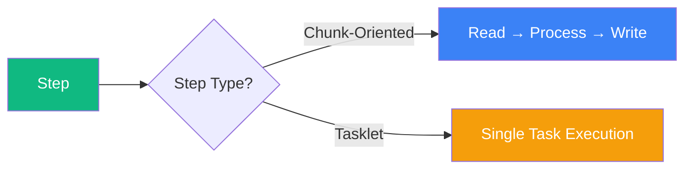

### Chunk-Oriented Processing

The read-process-write pattern for handling large datasets efficiently.

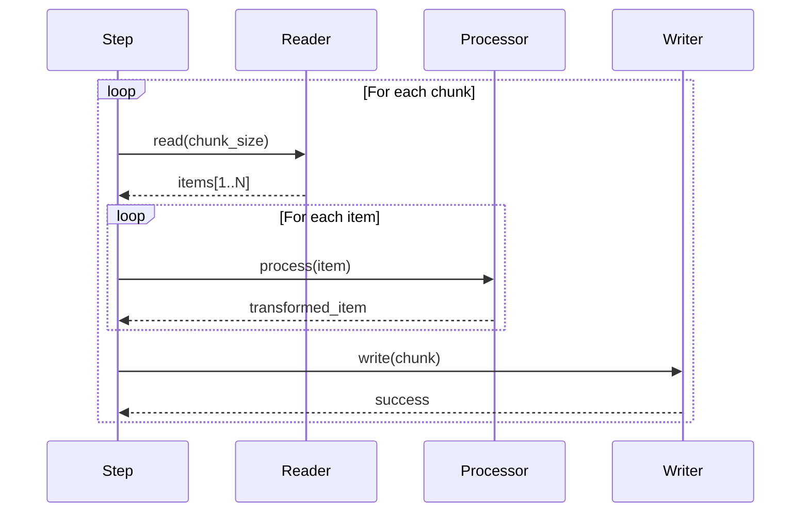

**Architecture Benefits:**
- **Memory Efficient**: Only loads chunk_size items at a time
- **Transactional**: Commits per chunk, not per item
- **Fault Tolerant**: Can skip failed items within limits
- **Performant**: Batches I/O operations

### ItemReader

Abstracts data retrieval from various sources.

```rust
pub trait ItemReader<T> {
    fn read(&mut self) -> Result<Option<T>, BatchError>;
}
```

**Design Pattern**: Iterator-like pattern with error handling

<CardGrid>
  <Card title="File Readers" icon="document">
    - CsvItemReader
    - JsonItemReader
    - XmlItemReader
  </Card>
  <Card title="Database Readers" icon="seti:db">
    - RdbcItemReader (SQL)
    - OrmItemReader (SeaORM)
    - MongoItemReader
  </Card>
  <Card title="Utility Readers" icon="star">
    - FakeItemReader
    - Custom implementations
  </Card>
</CardGrid>

### ItemProcessor

Transforms and validates items during processing.

```rust
pub trait ItemProcessor<I, O> {
    fn process(&self, item: I) -> Result<Option<O>, BatchError>;
}
```

**Key Features:**
- Type transformation: `I` → `O`
- Filtering: Return `None` to skip items
- Validation: Return `Err` for invalid items
- Stateless design for parallelization

### ItemWriter

Outputs processed items to destinations.

```rust
pub trait ItemWriter<T> {
    fn write(&mut self, items: &[T]) -> Result<(), BatchError>;
}
```

**Batch Writing**: Receives chunks of items for efficient I/O

### Tasklet

Single-task operations that don't fit the chunk pattern.

```rust
pub trait Tasklet {
    fn execute(&self, step_execution: &StepExecution)
        -> Result<RepeatStatus, BatchError>;
}
```

**Common Use Cases:**
- File compression (ZIP)
- File transfer (FTP/FTPS)
- Database maintenance
- Cleanup operations
- API calls

## Execution Flow

### Complete Job Execution

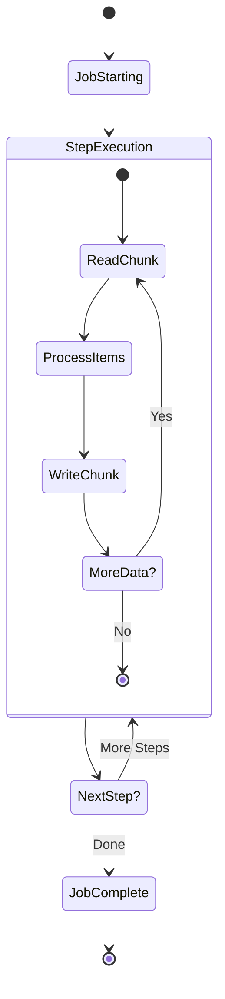

### Error Handling Flow

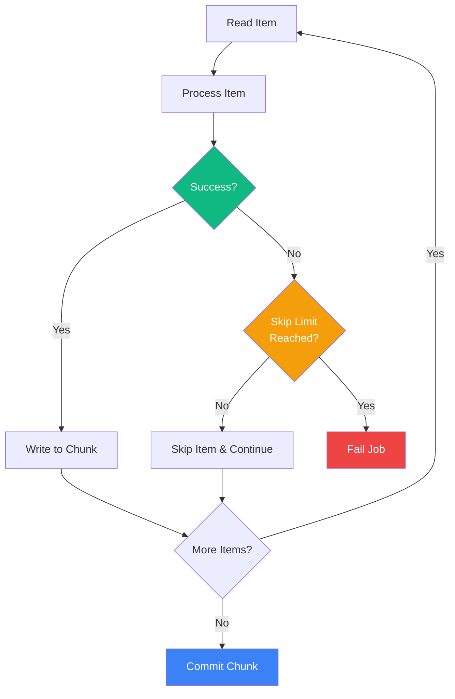

## Design Patterns

### Builder Pattern

All components use the builder pattern for flexible, type-safe construction.

```rust
let reader = CsvItemReaderBuilder::<Product>::new()
    .has_headers(true)
    .delimiter(b',')
    .from_path("products.csv")?;

let step = StepBuilder::new("process-products")
    .chunk(100)
    .reader(&reader)
    .processor(&processor)
    .writer(&writer)
    .skip_limit(10)
    .build();
```

**Benefits:**
- Clear, readable API
- Compile-time validation
- Sensible defaults
- Flexible configuration

### Strategy Pattern

Readers, processors, and writers are interchangeable strategies.

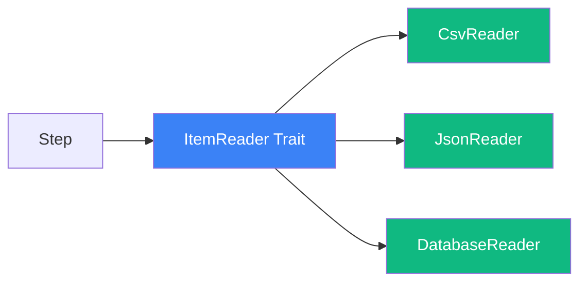

### Template Method Pattern

Job and Step execution follows a template with customizable steps.

```rust
// Framework provides the template
pub fn run(&self) -> Result<JobExecution, BatchError> {
    self.before_job()?;        // Hook
    let result = self.execute_steps()?;
    self.after_job()?;         // Hook
    Ok(result)
}
```

## Memory Model

### Chunk Processing Memory Usage

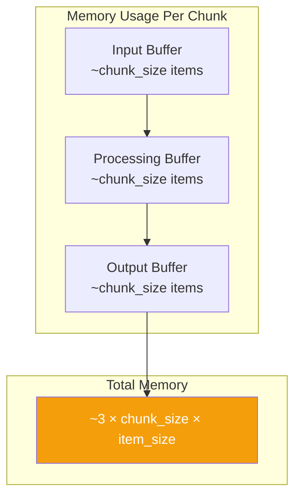

**Memory Optimization:**
- Adjust `chunk_size` based on available memory
- Use streaming for large items
- Paginate database queries
- Clear buffers after each chunk

### Resource Management

```rust
// Resources are automatically cleaned up
{
    let reader = CsvItemReaderBuilder::new()
        .from_path("large_file.csv")?;

    // File handle opened
    let step = StepBuilder::new("process")
        .chunk(1000)  // Only 1000 items in memory
        .reader(&reader)
        .build();

    job.run()?;
    // File handle automatically closed
}
```

## Concurrency Model

Spring Batch RS is designed for single-threaded execution by default, but supports parallelization strategies.

### Current Model: Sequential

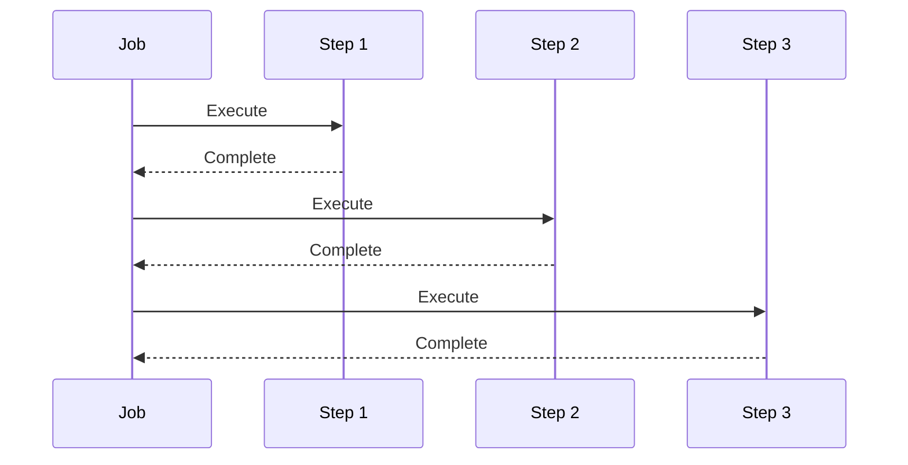

### Future: Parallel Steps

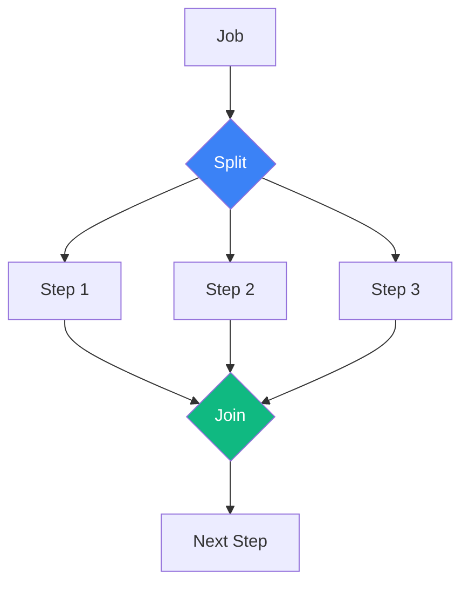

## Transaction Management

### Database Transactions

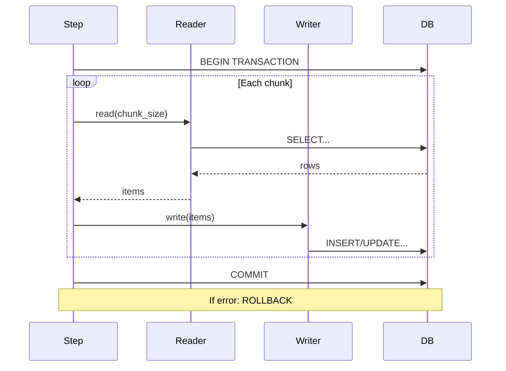

### File Operations

File operations are not transactional by default. Use staging directories:

```rust
// Write to temporary location
let temp_writer = JsonItemWriterBuilder::<TempData>::new()
    .from_path("/tmp/output.json")?;

// On success, move to final location
std::fs::rename("/tmp/output.json", "/final/output.json")?;
```

## Error Handling Architecture

<Tabs>
  <TabItem label="Skip Strategy">
    ```rust
    let step = StepBuilder::new("fault-tolerant")
        .chunk(100)
        .reader(&reader)
        .processor(&processor)
        .writer(&writer)
        .skip_limit(10)  // Skip up to 10 errors
        .build();
    ```

    **Use when**: Individual item failures shouldn't stop the job
  </TabItem>

  <TabItem label="Fail-Fast Strategy">
    ```rust
    let step = StepBuilder::new("critical-process")
        .chunk(100)
        .reader(&reader)
        .processor(&processor)
        .writer(&writer)
        // No skip_limit - fail on first error
        .build();
    ```

    **Use when**: Data integrity is critical
  </TabItem>

  <TabItem label="Retry Strategy">
    ```rust
    struct RetryProcessor<P> {
        inner: P,
        max_retries: u32,
    }

    impl<I, O, P> ItemProcessor<I, O> for RetryProcessor<P>
    where
        P: ItemProcessor<I, O>,
    {
        fn process(&self, item: I) -> Result<Option<O>, BatchError> {
            let mut attempts = 0;
            loop {
                match self.inner.process(item.clone()) {
                    Ok(result) => return Ok(result),
                    Err(e) if attempts < self.max_retries => {
                        attempts += 1;
                        std::thread::sleep(Duration::from_millis(100 * attempts));
                    }
                    Err(e) => return Err(e),
                }
            }
        }
    }
    ```

    **Use when**: Transient failures are expected (network, locks)
  </TabItem>
</Tabs>

## Performance Characteristics

### Throughput vs Memory Trade-offs

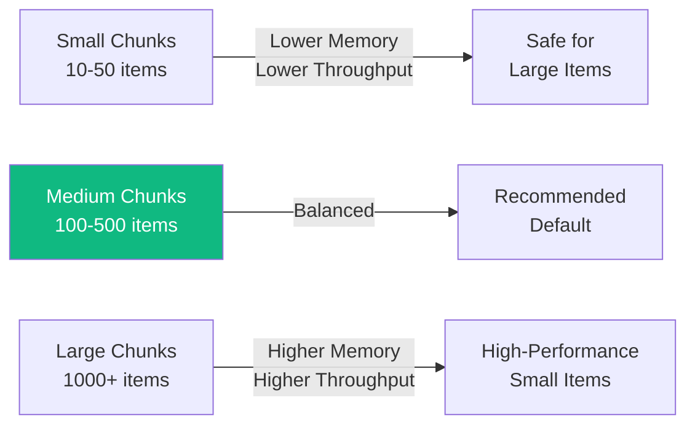

### Benchmarks (Typical)

| Operation | Small Chunks (10) | Medium Chunks (100) | Large Chunks (1000) |
|-----------|-------------------|---------------------|---------------------|
| CSV Read | 5,000/sec | 45,000/sec | 180,000/sec |
| JSON Write | 3,000/sec | 28,000/sec | 95,000/sec |
| DB Insert | 500/sec | 4,000/sec | 12,000/sec |

<Aside type="tip">
  **Optimization Tip**: Start with chunk size of 100, then increase based on memory availability and item size.
</Aside>

## Extension Points

### Custom ItemReader

```rust
use spring_batch_rs::core::item::ItemReader;
use spring_batch_rs::BatchError;

struct ApiItemReader {
    url: String,
    page: usize,
    buffer: Vec<Item>,
}

impl ItemReader<Item> for ApiItemReader {
    fn read(&mut self) -> Result<Option<Item>, BatchError> {
        if self.buffer.is_empty() {
            // Fetch next page
            self.fetch_page()?;
        }

        Ok(self.buffer.pop())
    }
}
```

### Custom Tasklet

```rust
use spring_batch_rs::core::step::{Tasklet, StepExecution, RepeatStatus};

struct CleanupTasklet {
    directory: PathBuf,
    days_old: u32,
}

impl Tasklet for CleanupTasklet {
    fn execute(&self, execution: &StepExecution)
        -> Result<RepeatStatus, BatchError>
    {
        // Custom cleanup logic
        self.delete_old_files()?;
        Ok(RepeatStatus::Finished)
    }
}
```

## Best Practices

<CardGrid>
  <Card title="1. Size Your Chunks Wisely" icon="rocket">
    - Start with 100 items
    - Monitor memory usage
    - Adjust based on item size
    - Consider database batch limits
  </Card>

  <Card title="2. Handle Errors Gracefully" icon="warning">
    - Set appropriate skip limits
    - Log skipped items
    - Implement retry logic for transient errors
    - Use validation early
  </Card>

  <Card title="3. Optimize I/O" icon="setting">
    - Use buffered readers/writers
    - Batch database operations
    - Compress network transfers
    - Cache reference data
  </Card>

  <Card title="4. Monitor & Measure" icon="information">
    - Track execution times
    - Monitor memory usage
    - Log progress regularly
    - Profile critical paths
  </Card>
</CardGrid>

## Summary

Spring Batch RS architecture provides:

✅ **Separation of Concerns**: Clear separation between reading, processing, and writing
✅ **Flexibility**: Multiple processing models (chunk vs tasklet)
✅ **Extensibility**: Easy to add custom components
✅ **Reliability**: Built-in error handling and recovery
✅ **Performance**: Optimized for throughput and memory efficiency
✅ **Type Safety**: Rust's strong type system prevents common errors

## Next Steps

- [Processing Models](/processing-models/) - Deep dive into chunk vs tasklet
- [Item Readers & Writers](/item-readers-writers/overview/) - Explore all I/O options
- [Examples](/examples/) - See architecture in action
