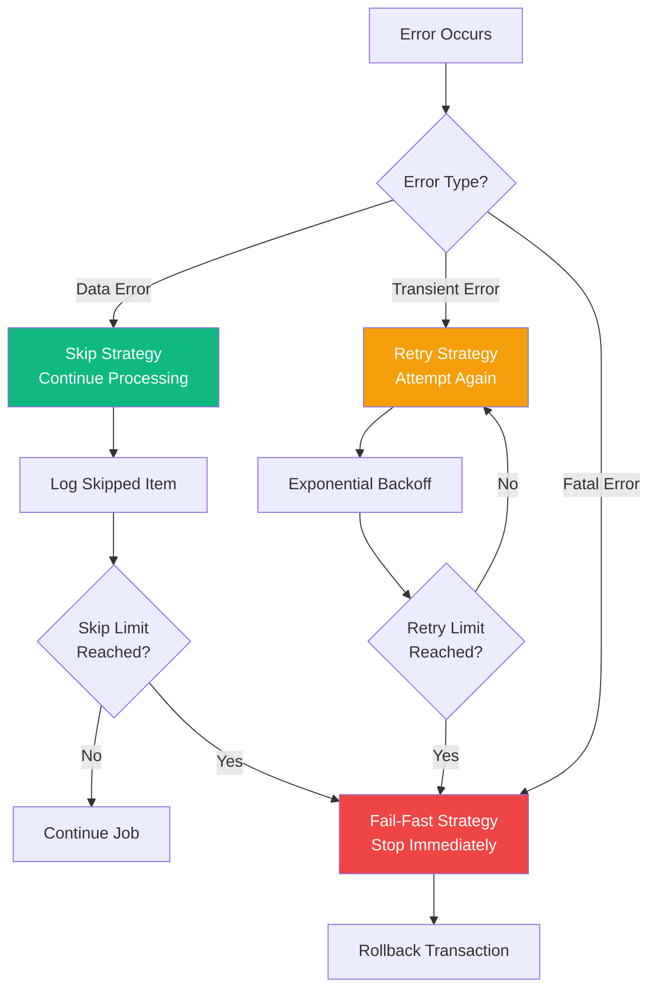
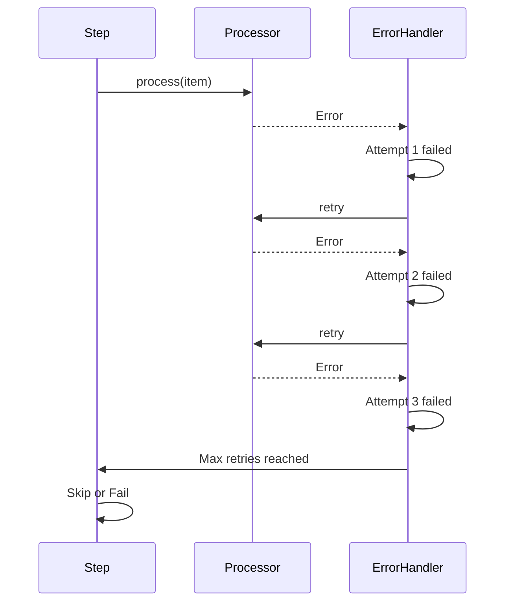
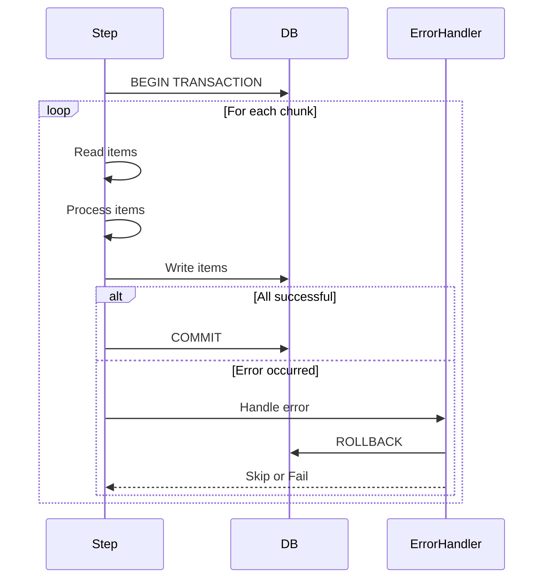
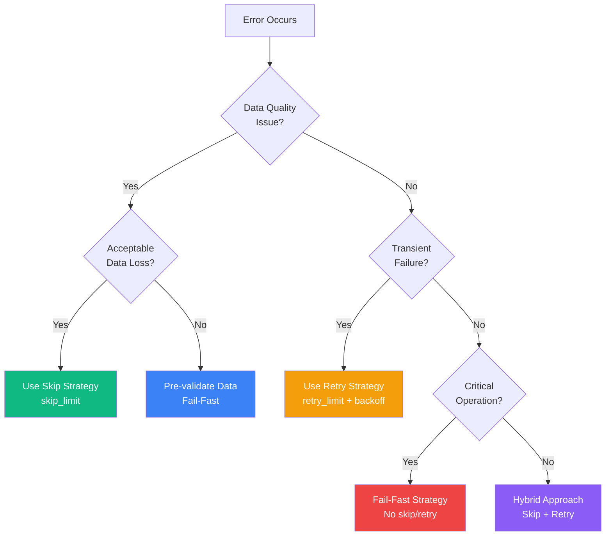

import { Card, CardGrid, Tabs, TabItem, Aside } from '@astrojs/starlight/components';

# Error Handling & Fault Tolerance

Batch jobs process thousands or millions of records. Robust error handling ensures your jobs can recover from failures gracefully without losing progress.

## Error Handling Philosophy



## Core Error Handling Strategies

<CardGrid>
  <Card title="Skip Strategy" icon="forward">
    **Best for**: Data quality issues, validation failures
    - Skip invalid records
    - Continue processing
    - Log errors for review
  </Card>

  <Card title="Retry Strategy" icon="refresh">
    **Best for**: Transient failures, network issues
    - Retry failed operations
    - Exponential backoff
    - Limit retry attempts
  </Card>

  <Card title="Fail-Fast Strategy" icon="error">
    **Best for**: Critical errors, data integrity
    - Stop immediately
    - Rollback transaction
    - Preserve data consistency
  </Card>
</CardGrid>

## Skip Strategy

### Basic Skip Configuration

```rust
use spring_batch_rs::core::step::StepBuilder;
use spring_batch_rs::item::csv::CsvItemReaderBuilder;
use spring_batch_rs::BatchError;
use serde::{Deserialize, Serialize};

#[derive(Debug, Deserialize, Serialize)]
struct Transaction {
    id: u32,
    amount: f64,
    account: String,
}

fn build_fault_tolerant_step() -> Step {
    let reader = CsvItemReaderBuilder::<Transaction>::new()
        .has_headers(true)
        .from_path("transactions.csv")?;

    let writer = DatabaseWriter::new(pool);

    StepBuilder::new("process-transactions")
        .chunk(100)
        .reader(&reader)
        .writer(&writer)
        .skip_limit(50)  // Skip up to 50 invalid records
        .build()
}
```

**Behavior:**
- First 50 errors → skip and continue
- 51st error → job fails
- All skipped items are logged

### Advanced Skip with Selective Skipping

Skip only specific error types:

```rust
use spring_batch_rs::core::step::{StepBuilder, SkipPolicy};
use spring_batch_rs::BatchError;

struct SelectiveSkipPolicy;

impl SkipPolicy for SelectiveSkipPolicy {
    fn should_skip(&self, error: &BatchError, skip_count: usize) -> bool {
        // Skip data validation errors, but not I/O errors
        match error {
            BatchError::ValidationError(_) => skip_count < 100,
            BatchError::ProcessingError(_) => skip_count < 50,
            BatchError::IoError(_) => false,  // Never skip I/O errors
            BatchError::DatabaseError(_) => false,  // Never skip DB errors
            _ => false,
        }
    }
}

fn build_selective_skip_step() -> Step {
    StepBuilder::new("selective-skip")
        .chunk(100)
        .reader(&reader)
        .processor(&processor)
        .writer(&writer)
        .skip_policy(SelectiveSkipPolicy)
        .build()
}
```

### Skip with Error Logging

Collect and report all skipped items:

```rust
use std::sync::{Arc, Mutex};
use spring_batch_rs::core::item::ItemProcessor;
use serde::{Deserialize, Serialize};

#[derive(Debug, Deserialize, Serialize, Clone)]
struct Record {
    id: u32,
    data: String,
}

struct ValidatingProcessor {
    error_log: Arc<Mutex<Vec<String>>>,
}

impl ValidatingProcessor {
    fn new() -> Self {
        Self {
            error_log: Arc::new(Mutex::new(Vec::new())),
        }
    }

    fn get_errors(&self) -> Vec<String> {
        self.error_log.lock().unwrap().clone()
    }
}

impl ItemProcessor<Record, Record> for ValidatingProcessor {
    fn process(&self, record: Record) -> ItemProcessorResult<Record> {
        // Validation logic
        if record.data.is_empty() {
            let error_msg = format!("Record {} has empty data", record.id);
            self.error_log.lock().unwrap().push(error_msg.clone());
            return Err(BatchError::ValidationError(error_msg));
        }

        if record.data.len() > 1000 {
            let error_msg = format!("Record {} data too long", record.id);
            self.error_log.lock().unwrap().push(error_msg.clone());
            return Err(BatchError::ValidationError(error_msg));
        }

        Ok(Some(record))
    }
}

// Usage
fn process_with_error_logging() -> Result<(), Box<dyn std::error::Error>> {
    let processor = ValidatingProcessor::new();
    let error_log = processor.error_log.clone();

    let step = StepBuilder::new("validate-records")
        .chunk(100)
        .reader(&reader)
        .processor(&processor)
        .writer(&writer)
        .skip_limit(100)
        .build();

    let execution = step.execute()?;

    // Write error log
    let errors = error_log.lock().unwrap();
    if !errors.is_empty() {
        std::fs::write("skipped_records.log", errors.join("\n"))?;
        println!("Skipped {} records - see skipped_records.log", errors.len());
    }

    println!("Processed: {}", execution.write_count);
    println!("Skipped: {}", execution.skip_count);

    Ok(())
}
```

## Retry Strategy

### Basic Retry Configuration

```rust
use spring_batch_rs::core::step::StepBuilder;

fn build_retry_step() -> Step {
    StepBuilder::new("process-with-retry")
        .chunk(100)
        .reader(&reader)
        .processor(&processor)
        .writer(&writer)
        .retry_limit(3)  // Retry each failed item up to 3 times
        .build()
}
```

**Behavior:**


### Retry with Exponential Backoff

Add delays between retries to handle transient issues:

```rust
use spring_batch_rs::core::item::ItemProcessor;
use spring_batch_rs::BatchError;
use std::time::Duration;
use std::thread;

struct RetryingProcessor<P> {
    inner: P,
    max_retries: u32,
    initial_backoff_ms: u64,
}

impl<I, O, P> ItemProcessor<I, O> for RetryingProcessor<P>
where
    P: ItemProcessor<I, O>,
    I: Clone,
{
    fn process(&self, item: I) -> ItemProcessorResult<O> {
        let mut attempts = 0;
        let mut backoff = self.initial_backoff_ms;

        loop {
            match self.inner.process(item.clone()) {
                Ok(result) => return Ok(result),
                Err(e) if Self::is_retryable(&e) && attempts < self.max_retries => {
                    attempts += 1;
                    println!("Retry attempt {} after {} ms", attempts, backoff);

                    thread::sleep(Duration::from_millis(backoff));

                    // Exponential backoff: 100ms, 200ms, 400ms, 800ms...
                    backoff *= 2;
                }
                Err(e) => return Err(e),
            }
        }
    }
}

impl<P> RetryingProcessor<P> {
    fn is_retryable(error: &BatchError) -> bool {
        matches!(
            error,
            BatchError::NetworkError(_) |
            BatchError::TemporaryError(_) |
            BatchError::TimeoutError(_)
        )
    }
}

// Usage
fn build_step_with_backoff() -> Step {
    let processor = RetryingProcessor {
        inner: MyProcessor::new(),
        max_retries: 5,
        initial_backoff_ms: 100,
    };

    StepBuilder::new("retry-with-backoff")
        .chunk(50)
        .reader(&reader)
        .processor(&processor)
        .writer(&writer)
        .build()
}
```

### Retry with Circuit Breaker

Stop retrying if too many consecutive failures occur:

```rust
use std::sync::atomic::{AtomicUsize, Ordering};
use std::sync::Arc;

struct CircuitBreakerProcessor<P> {
    inner: P,
    consecutive_failures: Arc<AtomicUsize>,
    circuit_breaker_threshold: usize,
    circuit_open: Arc<AtomicBool>,
}

impl<I, O, P> ItemProcessor<I, O> for CircuitBreakerProcessor<P>
where
    P: ItemProcessor<I, O>,
{
    fn process(&self, item: I) -> ItemProcessorResult<O> {
        // Check if circuit is open
        if self.circuit_open.load(Ordering::SeqCst) {
            return Err(BatchError::ProcessingError(
                "Circuit breaker is open - too many failures".to_string()
            ));
        }

        match self.inner.process(item) {
            Ok(result) => {
                // Reset failure count on success
                self.consecutive_failures.store(0, Ordering::SeqCst);
                Ok(result)
            }
            Err(e) => {
                // Increment failure count
                let failures = self.consecutive_failures.fetch_add(1, Ordering::SeqCst) + 1;

                if failures >= self.circuit_breaker_threshold {
                    self.circuit_open.store(true, Ordering::SeqCst);
                    println!("⚠️ Circuit breaker opened after {} failures", failures);
                }

                Err(e)
            }
        }
    }
}
```

## Fail-Fast Strategy

### Critical Data Integrity

For operations where any error is unacceptable:

```rust
fn build_fail_fast_step() -> Step {
    StepBuilder::new("critical-processing")
        .chunk(100)
        .reader(&reader)
        .processor(&processor)
        .writer(&writer)
        // No skip_limit - any error fails the job
        .build()
}
```

### Validation Before Processing

Validate all data before starting processing:

```rust
use spring_batch_rs::core::step::{Tasklet, StepExecution, RepeatStatus};
use spring_batch_rs::BatchError;

struct ValidationTasklet {
    file_path: String,
}

impl Tasklet for ValidationTasklet {
    fn execute(&self, _: &StepExecution) -> Result<RepeatStatus, BatchError> {
        println!("Validating data file: {}", self.file_path);

        let mut reader = csv::Reader::from_path(&self.file_path)?;
        let mut error_count = 0;
        let mut errors = Vec::new();

        for (line_num, result) in reader.records().enumerate() {
            match result {
                Ok(record) => {
                    // Validate record structure
                    if record.len() != 5 {
                        errors.push(format!("Line {}: Expected 5 fields, got {}", line_num + 1, record.len()));
                        error_count += 1;
                    }
                }
                Err(e) => {
                    errors.push(format!("Line {}: {}", line_num + 1, e));
                    error_count += 1;
                }
            }
        }

        if error_count > 0 {
            let error_message = format!(
                "Validation failed with {} errors:\n{}",
                error_count,
                errors.join("\n")
            );
            return Err(BatchError::ValidationError(error_message));
        }

        println!("✓ Validation successful");
        Ok(RepeatStatus::Finished)
    }
}

// Usage: Validate before processing
fn build_validated_job() -> Job {
    let validation_step = StepBuilder::new("validate")
        .tasklet(&ValidationTasklet {
            file_path: "data.csv".to_string(),
        })
        .build();

    let processing_step = StepBuilder::new("process")
        .chunk(100)
        .reader(&reader)
        .processor(&processor)
        .writer(&writer)
        .build();

    JobBuilder::new()
        .start(&validation_step)  // Validate first
        .next(&processing_step)    // Then process
        .build()
}
```

## Transaction Management

### Chunk-Level Transactions



### Transactional Database Writer

```rust
use spring_batch_rs::core::item::ItemWriter;
use spring_batch_rs::BatchError;
use sqlx::{PgPool, Postgres, Transaction};

struct TransactionalWriter {
    pool: PgPool,
}

impl<T> ItemWriter<T> for TransactionalWriter
where
    T: Serialize,
{
    fn write(&mut self, items: &[T]) -> ItemWriterResult {
        // Start transaction
        let mut tx = self.pool.begin().await?;

        // Attempt to write all items
        for item in items {
            let result = sqlx::query("INSERT INTO table (data) VALUES ($1)")
                .bind(serde_json::to_value(item)?)
                .execute(&mut tx)
                .await;

            if let Err(e) = result {
                // Rollback on any error
                tx.rollback().await?;
                return Err(BatchError::DatabaseError(e.to_string()));
            }
        }

        // Commit if all succeeded
        tx.commit().await?;

        Ok(())
    }
}
```

## Error Recovery Patterns

### Checkpoint and Resume

Save progress to resume after failure:

```rust
use spring_batch_rs::core::step::StepExecution;
use std::fs;
use serde::{Serialize, Deserialize};

#[derive(Serialize, Deserialize)]
struct Checkpoint {
    last_processed_id: u32,
    processed_count: usize,
    error_count: usize,
}

impl Checkpoint {
    fn save(&self, path: &str) -> Result<(), BatchError> {
        let json = serde_json::to_string_pretty(self)?;
        fs::write(path, json)?;
        Ok(())
    }

    fn load(path: &str) -> Result<Self, BatchError> {
        let json = fs::read_to_string(path)?;
        Ok(serde_json::from_str(&json)?)
    }
}

struct ResumableReader {
    checkpoint_file: String,
    last_id: u32,
}

impl ItemReader<Record> for ResumableReader {
    fn read(&mut self) -> ItemReaderResult<Record> {
        // Load checkpoint if exists
        if self.last_id == 0 {
            if let Ok(checkpoint) = Checkpoint::load(&self.checkpoint_file) {
                self.last_id = checkpoint.last_processed_id;
                println!("Resuming from ID: {}", self.last_id);
            }
        }

        // Read next record after last checkpoint
        let record = self.fetch_next_record()?;

        if let Some(ref rec) = record {
            // Save checkpoint periodically
            if rec.id % 1000 == 0 {
                Checkpoint {
                    last_processed_id: rec.id,
                    processed_count: rec.id as usize,
                    error_count: 0,
                }.save(&self.checkpoint_file)?;
            }
        }

        Ok(record)
    }
}
```

### Dead Letter Queue

Move failed items to a separate queue for later review:

```rust
use spring_batch_rs::core::item::{ItemWriter, ItemProcessor};
use std::sync::{Arc, Mutex};

struct DeadLetterWriter<T> {
    file_path: String,
    failed_items: Arc<Mutex<Vec<T>>>,
}

impl<T> DeadLetterWriter<T>
where
    T: Serialize + Clone,
{
    fn new(file_path: String) -> Self {
        Self {
            file_path,
            failed_items: Arc::new(Mutex::new(Vec::new())),
        }
    }

    fn add_failed_item(&self, item: T) {
        self.failed_items.lock().unwrap().push(item);
    }

    fn flush(&self) -> ItemWriterResult {
        let items = self.failed_items.lock().unwrap();

        if items.is_empty() {
            return Ok(());
        }

        let json = serde_json::to_string_pretty(&*items)?;
        std::fs::write(&self.file_path, json)?;

        println!("Wrote {} failed items to {}", items.len(), self.file_path);

        Ok(())
    }
}

struct FaultTolerantProcessor<P> {
    inner: P,
    dead_letter_writer: Arc<DeadLetterWriter<Item>>,
}

impl<P> ItemProcessor<Item, Item> for FaultTolerantProcessor<P>
where
    P: ItemProcessor<Item, Item>,
{
    fn process(&self, item: Item) -> ItemProcessorResult<Item> {
        match self.inner.process(item.clone()) {
            Ok(result) => Ok(result),
            Err(e) => {
                // Log to dead letter queue
                self.dead_letter_writer.add_failed_item(item);
                println!("Item added to dead letter queue: {}", e);

                // Skip the item
                Ok(None)
            }
        }
    }
}

// Usage
fn process_with_dead_letter_queue() -> Result<(), Box<dyn std::error::Error>> {
    let dlq = Arc::new(DeadLetterWriter::new("failed_items.json".to_string()));

    let processor = FaultTolerantProcessor {
        inner: MyProcessor::new(),
        dead_letter_writer: dlq.clone(),
    };

    let step = StepBuilder::new("process-with-dlq")
        .chunk(100)
        .reader(&reader)
        .processor(&processor)
        .writer(&writer)
        .build();

    step.execute()?;

    // Flush dead letter queue
    dlq.flush()?;

    Ok(())
}
```

## Best Practices

<CardGrid>
  <Card title="Choose the Right Strategy" icon="puzzle">
    - **Skip**: Data quality issues, optional validations
    - **Retry**: Network errors, temporary failures
    - **Fail-Fast**: Critical operations, data integrity
  </Card>

  <Card title="Set Appropriate Limits" icon="setting">
    - **Skip Limit**: Based on acceptable data loss
    - **Retry Limit**: 3-5 attempts is typical
    - **Timeout**: Prevent infinite retries
  </Card>

  <Card title="Log Everything" icon="document">
    - Log all skipped items with reasons
    - Track error patterns over time
    - Generate error reports
    - Monitor error rates
  </Card>

  <Card title="Test Error Scenarios" icon="approve-check">
    - Simulate failures in tests
    - Verify retry behavior
    - Test transaction rollback
    - Validate error recovery
  </Card>
</CardGrid>

<Aside type="caution">
  **Important**: Always set reasonable limits! Unlimited retries or skips can hide serious problems and waste resources.
</Aside>

## Error Handling Decision Tree



## Next Steps

- [Quick Examples](/quick-examples/) - See error handling in action
- [Examples](/examples/) - Complete fault-tolerant examples
- [Architecture](/architecture/) - Understand error handling architecture
