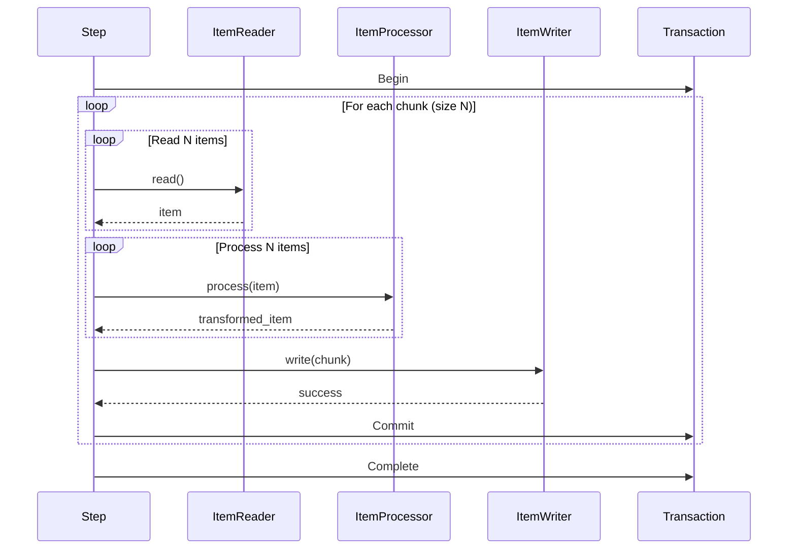
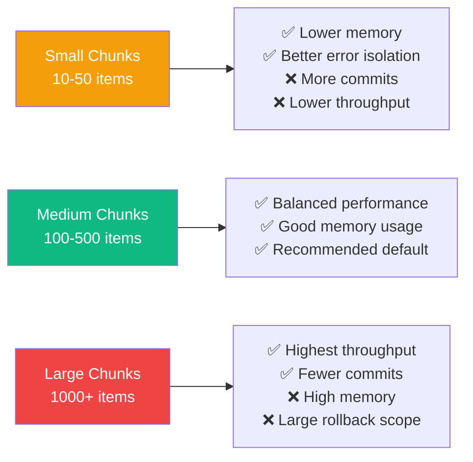
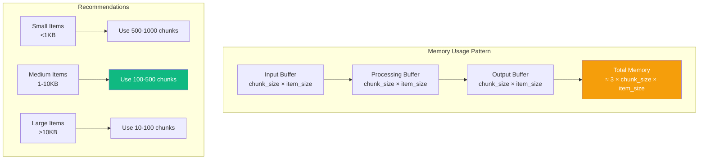
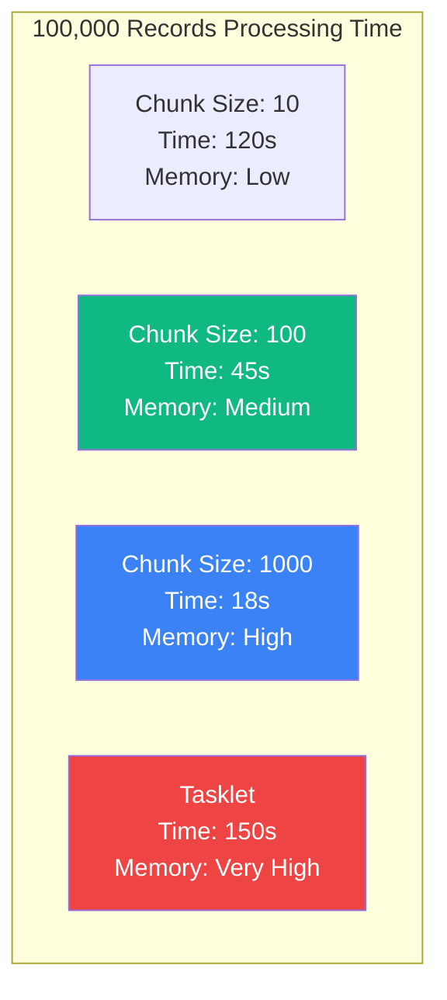
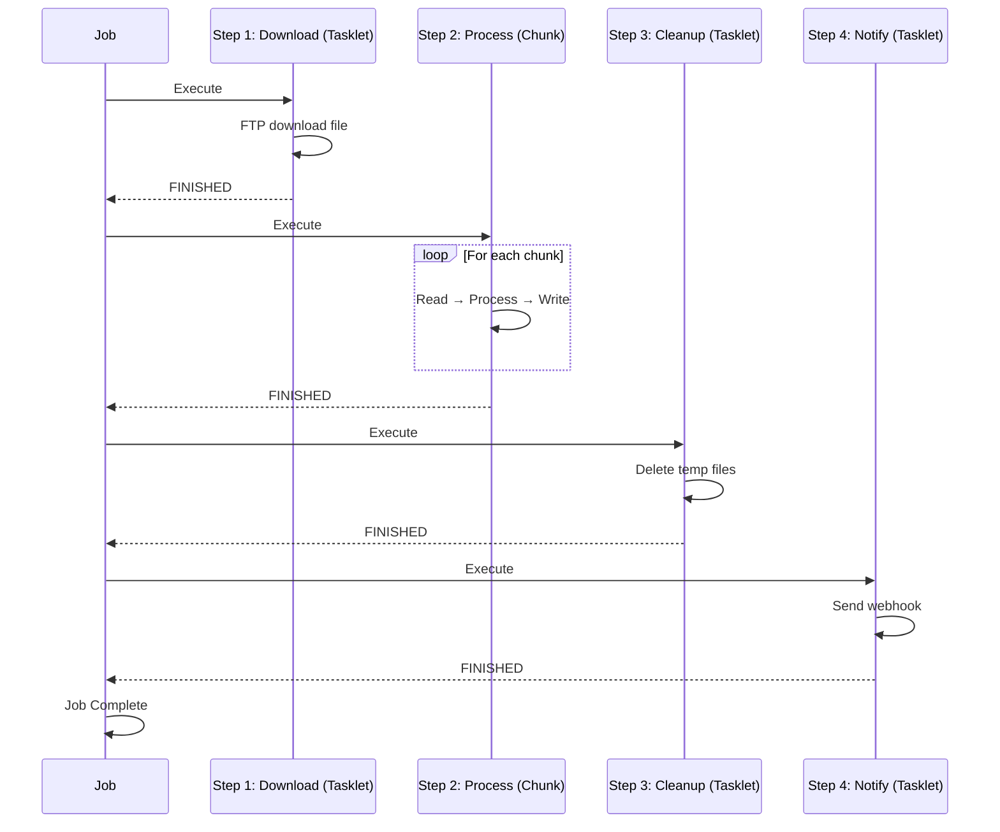

import { Card, CardGrid, Tabs, TabItem, Aside } from '@astrojs/starlight/components';

# Processing Models

Spring Batch RS supports two distinct processing models, each optimized for different use cases. Understanding when to use each pattern is crucial for building efficient batch applications.

## Overview


## Chunk-Oriented Processing

### What is Chunk Processing?

Chunk-oriented processing follows the **read-process-write** pattern, handling large datasets by breaking them into manageable chunks. This is the most common pattern for batch processing.

### Architecture



### Basic Example

```rust
use spring_batch_rs::core::step::StepBuilder;
use spring_batch_rs::item::csv::CsvItemReaderBuilder;
use spring_batch_rs::item::json::JsonItemWriterBuilder;
use serde::{Deserialize, Serialize};

#[derive(Debug, Deserialize, Serialize)]
struct Customer {
    id: u32,
    name: String,
    email: String,
    status: String,
}

fn main() -> Result<(), Box<dyn std::error::Error>> {
    // Create reader
    let reader = CsvItemReaderBuilder::<Customer>::new()
        .has_headers(true)
        .from_path("customers.csv")?;

    // Create processor (transform data)
    let processor = |customer: Customer| -> Result<Option<Customer>, _> {
        // Business logic: only active customers
        if customer.status == "active" {
            Ok(Some(customer))
        } else {
            Ok(None) // Filter out
        }
    };

    // Create writer
    let writer = JsonItemWriterBuilder::<Customer>::new()
        .from_path("active_customers.json")?;

    // Build step with chunk processing
    let step = StepBuilder::new("process-customers")
        .chunk(100)  // Process 100 items at a time
        .reader(&reader)
        .processor(&processor)
        .writer(&writer)
        .build();

    // Execute
    let execution = step.execute()?;
    println!("Processed {} items", execution.read_count);

    Ok(())
}
```

### When to Use Chunk Processing

<CardGrid>
  <Card title="✅ Perfect For" icon="approve-check">
    - **Large Datasets**: Millions of records to process
    - **ETL Operations**: Extract, Transform, Load workflows
    - **Data Migration**: Moving data between systems
    - **File Processing**: CSV, JSON, XML transformations
    - **Database Operations**: Bulk inserts, updates
  </Card>

  <Card title="❌ Not Ideal For" icon="warning">
    - **Single Operations**: One-time file compression
    - **Non-data Tasks**: Network requests, cleanup
    - **Streaming Data**: Real-time event processing
    - **Complex Branching**: Dynamic workflow decisions
  </Card>
</CardGrid>

### Chunk Size Optimization



### Advanced Chunk Example with Fault Tolerance

```rust
use spring_batch_rs::core::step::StepBuilder;
use spring_batch_rs::core::item::{ItemReader, ItemProcessor, ItemWriter};
use spring_batch_rs::BatchError;

#[derive(Debug, Clone)]
struct Order {
    id: u32,
    total: f64,
    items: Vec<String>,
}

struct OrderValidator;

impl ItemProcessor<Order, Order> for OrderValidator {
    fn process(&self, order: Order) -> Result<Option<Order>, BatchError> {
        // Validate order
        if order.total < 0.0 {
            return Err(BatchError::ProcessingError(
                format!("Invalid total for order {}", order.id)
            ));
        }

        if order.items.is_empty() {
            return Err(BatchError::ProcessingError(
                format!("Empty order {}", order.id)
            ));
        }

        Ok(Some(order))
    }
}

fn build_fault_tolerant_step(
    reader: impl ItemReader<Order>,
    writer: impl ItemWriter<Order>,
) -> Step {
    StepBuilder::new("process-orders")
        .chunk(200)
        .reader(&reader)
        .processor(&OrderValidator)
        .writer(&writer)
        .skip_limit(10)  // Skip up to 10 invalid orders
        .retry_limit(3)   // Retry failed items 3 times
        .build()
}
```

### Memory Considerations



## Tasklet Processing

### What is a Tasklet?

A tasklet is a **single-task operation** that executes custom logic. Unlike chunk processing, it doesn't follow the read-process-write pattern. Tasklets are perfect for non-data-driven operations.

### Architecture

```mermaid
graph LR
    Step[Step Execution] --> Tasklet[Tasklet.execute()]
    Tasklet --> Logic{Custom Logic}
    Logic --> Status{Return Status}
    Status -->|FINISHED| Complete[Step Complete]
    Status -->|CONTINUABLE| Repeat[Execute Again]

    style Tasklet fill:#10b981,color:#fff
    style Complete fill:#3b82f6,color:#fff
```

### Basic Example

```rust
use spring_batch_rs::core::step::{Tasklet, StepExecution, RepeatStatus};
use spring_batch_rs::core::step::StepBuilder;
use spring_batch_rs::BatchError;
use std::path::Path;

struct FileCompressionTasklet {
    source_dir: String,
    target_file: String,
}

impl Tasklet for FileCompressionTasklet {
    fn execute(
        &self,
        step_execution: &StepExecution,
    ) -> Result<RepeatStatus, BatchError> {
        println!("Compressing files from {}", self.source_dir);

        // Custom compression logic
        let files = std::fs::read_dir(&self.source_dir)?;
        let mut archive = zip::ZipWriter::new(
            std::fs::File::create(&self.target_file)?
        );

        for entry in files {
            let entry = entry?;
            let path = entry.path();

            if path.is_file() {
                let file_name = path.file_name()
                    .unwrap()
                    .to_string_lossy();

                archive.start_file(file_name, Default::default())?;
                let contents = std::fs::read(&path)?;
                archive.write_all(&contents)?;

                println!("Added: {}", file_name);
            }
        }

        archive.finish()?;
        println!("Created archive: {}", self.target_file);

        Ok(RepeatStatus::Finished)
    }
}

fn main() -> Result<(), Box<dyn std::error::Error>> {
    let tasklet = FileCompressionTasklet {
        source_dir: "data/exports".to_string(),
        target_file: "archive.zip".to_string(),
    };

    let step = StepBuilder::new("compress-files")
        .tasklet(&tasklet)
        .build();

    step.execute()?;

    Ok(())
}
```

### When to Use Tasklets

<CardGrid>
  <Card title="✅ Perfect For" icon="approve-check">
    - **File Operations**: Compression, encryption, transfer
    - **Network Tasks**: FTP uploads, API calls
    - **Database Maintenance**: Cleanup, vacuum, optimize
    - **System Operations**: Directory creation, cleanup
    - **Pre/Post Processing**: Setup and teardown tasks
  </Card>

  <Card title="❌ Not Ideal For" icon="warning">
    - **Large Datasets**: Use chunk processing instead
    - **Item Transformation**: Use ItemProcessor
    - **Streaming Data**: Use readers/writers
    - **Transaction Per Item**: Use chunk processing
  </Card>
</CardGrid>

### Common Tasklet Patterns

<Tabs>
  <TabItem label="File Transfer">
    ```rust
    use spring_batch_rs::core::step::{Tasklet, StepExecution, RepeatStatus};
    use spring_batch_rs::BatchError;

    struct FtpUploadTasklet {
        local_path: String,
        remote_path: String,
        host: String,
    }

    impl Tasklet for FtpUploadTasklet {
        fn execute(&self, _: &StepExecution) -> Result<RepeatStatus, BatchError> {
            println!("Uploading {} to {}", self.local_path, self.remote_path);

            // FTP connection and upload logic
            let mut ftp = ftp::FtpStream::connect(&self.host)?;
            ftp.login("user", "password")?;

            let file = std::fs::File::open(&self.local_path)?;
            let mut reader = std::io::BufReader::new(file);

            ftp.put(&self.remote_path, &mut reader)?;
            ftp.quit()?;

            println!("Upload complete");
            Ok(RepeatStatus::Finished)
        }
    }
    ```
  </TabItem>

  <TabItem label="Database Cleanup">
    ```rust
    use spring_batch_rs::core::step::{Tasklet, StepExecution, RepeatStatus};
    use spring_batch_rs::BatchError;
    use sqlx::PgPool;

    struct DatabaseCleanupTasklet {
        pool: PgPool,
        days_to_keep: i32,
    }

    impl Tasklet for DatabaseCleanupTasklet {
        fn execute(&self, _: &StepExecution) -> Result<RepeatStatus, BatchError> {
            let query = format!(
                "DELETE FROM logs WHERE created_at < NOW() - INTERVAL '{} days'",
                self.days_to_keep
            );

            let result = sqlx::query(&query)
                .execute(&self.pool)
                .await?;

            println!("Deleted {} old log records", result.rows_affected());

            Ok(RepeatStatus::Finished)
        }
    }
    ```
  </TabItem>

  <TabItem label="API Integration">
    ```rust
    use spring_batch_rs::core::step::{Tasklet, StepExecution, RepeatStatus};
    use spring_batch_rs::BatchError;
    use reqwest;

    struct NotificationTasklet {
        webhook_url: String,
        message: String,
    }

    impl Tasklet for NotificationTasklet {
        fn execute(&self, execution: &StepExecution) -> Result<RepeatStatus, BatchError> {
            let client = reqwest::blocking::Client::new();

            let payload = serde_json::json!({
                "step": execution.step_name,
                "status": "completed",
                "message": self.message,
                "items_processed": execution.read_count,
            });

            let response = client
                .post(&self.webhook_url)
                .json(&payload)
                .send()?;

            if response.status().is_success() {
                println!("Notification sent successfully");
                Ok(RepeatStatus::Finished)
            } else {
                Err(BatchError::ProcessingError(
                    format!("Failed to send notification: {}", response.status())
                ))
            }
        }
    }
    ```
  </TabItem>
</Tabs>

### Repeatable Tasklets

Tasklets can return `RepeatStatus::CONTINUABLE` to execute multiple times:

```rust
use spring_batch_rs::core::step::{Tasklet, StepExecution, RepeatStatus};
use spring_batch_rs::BatchError;
use std::sync::atomic::{AtomicUsize, Ordering};

struct PagedApiTasklet {
    api_url: String,
    current_page: AtomicUsize,
    total_pages: usize,
}

impl Tasklet for PagedApiTasklet {
    fn execute(&self, _: &StepExecution) -> Result<RepeatStatus, BatchError> {
        let page = self.current_page.fetch_add(1, Ordering::SeqCst);

        if page >= self.total_pages {
            return Ok(RepeatStatus::Finished);
        }

        // Fetch and process page
        let url = format!("{}?page={}", self.api_url, page);
        let response = reqwest::blocking::get(&url)?;
        let data = response.json::<Vec<serde_json::Value>>()?;

        println!("Processed page {}: {} items", page, data.len());

        // Continue to next page
        Ok(RepeatStatus::CONTINUABLE)
    }
}
```

## Comparison: Chunk vs Tasklet

### Decision Matrix

| Criteria | Chunk Processing | Tasklet Processing |
|----------|------------------|-------------------|
| **Data Volume** | Large (1000s-millions) | Small or N/A |
| **Transaction Scope** | Per chunk | Entire task |
| **Memory Usage** | Controlled (chunk size) | Depends on task |
| **Error Handling** | Skip/retry per item | All or nothing |
| **Complexity** | Higher (3 components) | Lower (1 component) |
| **Throughput** | Very high | Task-dependent |
| **Best For** | ETL, migration | Utility tasks |

### Performance Comparison



<Aside type="tip">
  **Rule of Thumb**: If your task processes individual items from a data source, use **chunk processing**. If it's a singular operation (compress, upload, cleanup), use a **tasklet**.
</Aside>

## Hybrid Approach: Combining Both

Real-world jobs often combine both patterns:

```rust
use spring_batch_rs::core::job::JobBuilder;
use spring_batch_rs::core::step::StepBuilder;

fn build_etl_job() -> Job {
    // Step 1: Tasklet - Download file from FTP
    let download_step = StepBuilder::new("download-data")
        .tasklet(&FtpDownloadTasklet {
            host: "ftp.example.com".to_string(),
            remote_file: "data.csv".to_string(),
            local_file: "temp/data.csv".to_string(),
        })
        .build();

    // Step 2: Chunk - Process the data
    let process_step = StepBuilder::new("process-data")
        .chunk(500)
        .reader(&csv_reader)
        .processor(&data_transformer)
        .writer(&database_writer)
        .skip_limit(100)
        .build();

    // Step 3: Tasklet - Cleanup temp files
    let cleanup_step = StepBuilder::new("cleanup")
        .tasklet(&CleanupTasklet {
            directory: "temp/".to_string(),
        })
        .build();

    // Step 4: Tasklet - Send completion notification
    let notify_step = StepBuilder::new("notify")
        .tasklet(&NotificationTasklet {
            webhook_url: "https://hooks.slack.com/...".to_string(),
            message: "ETL job completed".to_string(),
        })
        .build();

    JobBuilder::new()
        .start(&download_step)
        .next(&process_step)
        .next(&cleanup_step)
        .next(&notify_step)
        .build()
}
```

### Execution Flow



## Best Practices

<CardGrid>
  <Card title="Chunk Processing" icon="rocket">
    - Start with chunk size of 100, adjust based on metrics
    - Monitor memory usage and adjust chunk size
    - Use skip_limit for fault tolerance
    - Keep processors stateless for parallelization
    - Use appropriate transaction boundaries
  </Card>

  <Card title="Tasklet Processing" icon="setting">
    - Keep tasklets focused on single responsibility
    - Use for setup/teardown operations
    - Handle errors explicitly
    - Log progress for long-running tasks
    - Return FINISHED when complete
  </Card>

  <Card title="Job Design" icon="puzzle">
    - Use tasklets for pre/post processing
    - Use chunks for data transformation
    - Order steps logically (download → process → cleanup)
    - Consider rollback scenarios
    - Add monitoring and notifications
  </Card>
</CardGrid>

## Next Steps

- [Error Handling](/error-handling/) - Implement robust fault tolerance
- [Examples](/examples/) - See complete working examples
- [Item Readers & Writers](/item-readers-writers/overview/) - Explore all I/O options
